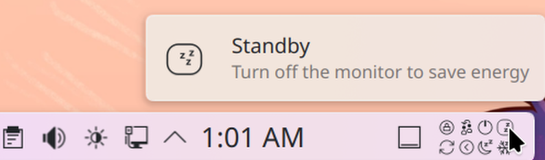
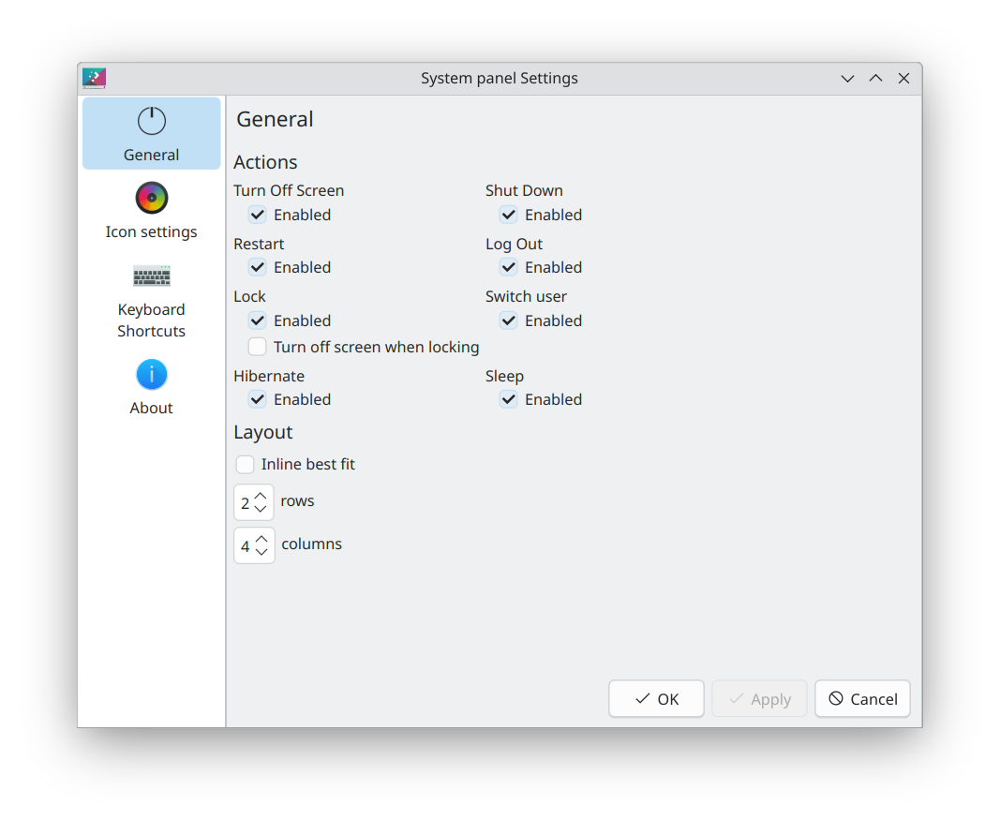
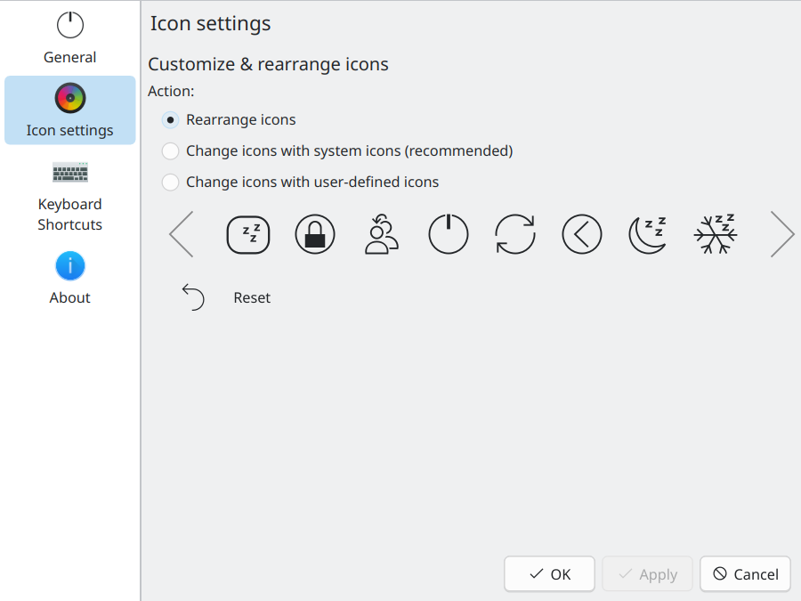

# plasma6-applets-system-panel
Plasma6 applet that displays a panel with a set of system actions.

## Screenshots:

---

---

---


## Supported actions:
- Standby (turn off monitor to save energy).
- Lock screen.
- Shut Down.
- Restart.
- Log out.
- Switch user (switch user o create new session).
- Sleep (suspend to RAM).
- Hibernate (suspend to disk).

## Other features
- Supports different layouts.
- Ability to rearrange icons.
- Fully customizable icons.
- Integration with Breeze and Breeze Dark themes.

## Supported languages
- Dutch.
- English (default).
- French.
- Spanish.

## Testing source code locally
You can test this code locally by issuing the following command:
```
QT_LOGGING_RULES="qml.debug=true" plasmoidviewer -a src/package/
```